[](https://www.microchip.com)

# AVR64EA48 Breathing LED with Timer's Compare Channel

1. This project showcases the usage of a "pseudo" Pulse-Width Modulation (PWM) provided by Timer/Counter type A (TCA)'s Compare Channel using AVR64EA48 Curiosity Nano board with the help from MCC Melody;
2. The project uses two timers (TCA0 and TCA1), one LED (LED0), and one Switch (SW0);
3. TCA0 produces PWM and toggles LED0. TCA1 modifies the duty cycle of TAC0 to change the brightness of LED0. SW0 switches between a long and a short time period of TCA1 to change the speed of breathing.

#### AVR64EA48 Curiosity Nano Development Board:
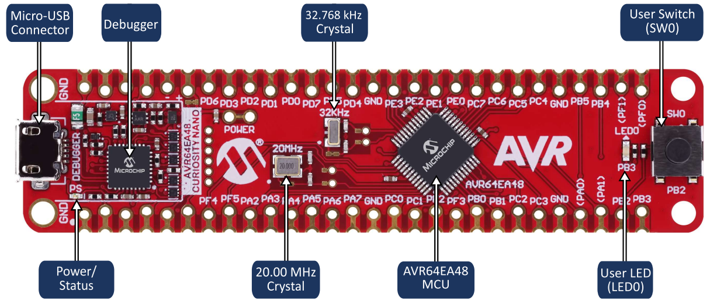


## Related Documentation

- [MPLAB® Code Configurator](https://www.microchip.com/en-us/development-tools-tools-and-software/embedded-software-center/mplab-code-configurator)

- [MCC Melody API Reference for AVR MCU Families ver.17](https://onlinedocs.microchip.com/oxy/GUID-41EA2496-1EE8-4319-A387-9EC9318EF178-en-US-17/index.html)

- [AVR64EA48 Product Page](https://www.microchip.com/en-us/product/AVR64EA48)

- [Another Breathing LED Demo Using PWM and CLC](https://mplab-discover.microchip.com/v2/item/com.microchip.code.examples/com.microchip.ide.project/com.microchip.subcategories.tools.Others/com.microchip.mcu8.mplabx.project.pic18f16q41-breathing-led-mplab-mcc/1.0.0?view=about&dsl=breathing)

## Software Used

- MPLAB® X IDE 6.15.0 or newer [(MPLAB® X IDE 6.15)](https://www.microchip.com/en-us/tools-resources/develop/mplab-x-ide)

- MPLAB® XC8 2.45.0 or newer compiler [(MPLAB® XC8 2.45)](https://www.microchip.com/en-us/tools-resources/develop/mplab-xc-compilers)

- Microchip AVR-Ex Series Device Support (2.6.181) or newer [(packs.download.microchip.com/)](https://packs.download.microchip.com/)

- MPLAB® Code Configurator (MCC) 5.3.7 or newer [(microchip.com/mplab/mplab-code-configurator)](https://www.microchip.com/mplab/mplab-code-configurator)

## Hardware Used

- [AVR64EA48 Curiosity Nano Evaluation Kit Product Page](https://www.microchip.com/en-us/development-tool/ev66e56a)
- Micro-USB to USB 2.0 cable


## Setup

1. Connect the AVR64EA48 Curiosity Nano board to a PC using the Micro-USB to USB 2.0 cable. 

2. If not already on your system, download and install MPLAB X IDE version 6.15 (or newer).

3. If not already on your system, download and install the XC8 C-Compiler version 2.45 (or newer).

> &#128064;: If you wish to run the example and see the result first, open the .X project file inside MPLAB X IDE and then click . The LED on the Curiosity Nano should appear to light up and dim as if it were breathing. Pressing the button on the board will make the LED 'breathe' faster. 

> 
>
>&#128221;: Follow the steps below to recreate this example step by step using MCC Melody.

4. Create a new `Standalone Project`, select `AVR64EA48` as `Device` and `XC8 (v2.45)` as `Compiler Toolchains`. 
You may refer to the step 1 of [Creating a Project with Touch Library - Developer Help](https://microchipdeveloper.com/touch:generate-touch-project-with-mcc-melody) for details.

5. Click , `Select MCC Melody`, and click `Finish`.  
You may refer to the step 2 of [Creating a Project with Touch Library - Developer Help](https://microchipdeveloper.com/touch:generate-touch-project-with-mcc-melody) for details.


### MCC Settings 

#### 1. Pins
- Open **Pin Grid View** Window
  - Select `PB2` (SW0) as `GPIO input`
  - Select `PB3` (LED0) as `GPIO output`
  
  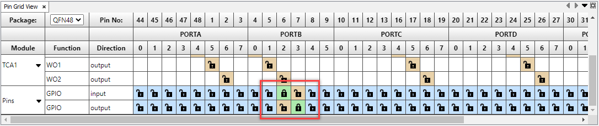

- Click `Pins` under **Project Resources**, then click **System**
  - `PB2`: 
    - Rename "IO_PB2" to "Switch"
    - Check `Pull-up` box
  - `PB3`:
    - Rename "IO_PB3" to "LED"

  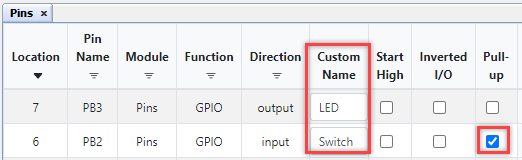

#### 2. Timers
- Find `Timer` under **Device Resources**, go to **Drivers**, click  in front of `TCA0` and `TCA1`
- Click `TCA0` under **Project Resources**, go to **Drivers**, then **Timer**
  - Set `Requested Timeout (s)` to `0.0005` (500 us)
  - Change `Waveform Generation Mode` to `Dual Slope PWM, overflow on BOTTOM`
  - Turn on `Enable Channel 0`, set `Duty Cycle 0 (%)` to `5`
  
  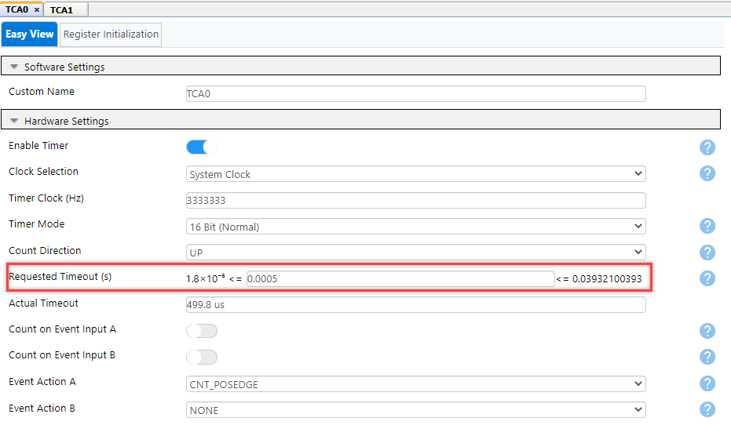
  
  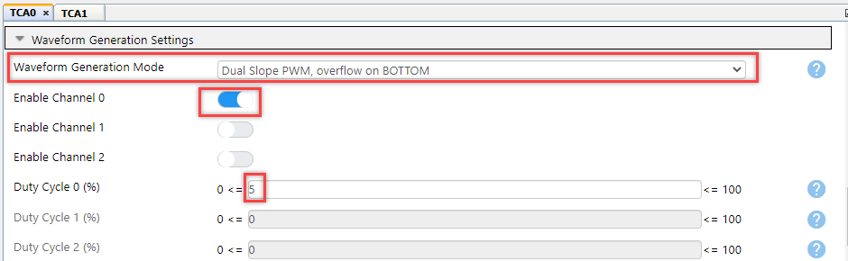
- Click `TCA1` under **Project Resources**, go to **Drivers**, then **Timer**
  - Change `Clock Selection` to `System Clock / 8`
  - Set `Requested Timeout (s)` to `0.08` (80 ms)
   
  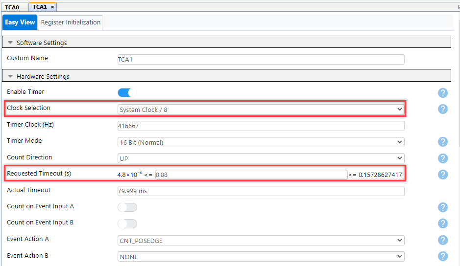

#### 3. Interrupts
- Click `Interrupt Manager` under **Project Resources**, then **System**
  - Turn on `Global Interrupt Enable`

  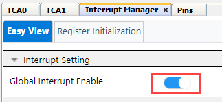
- Click `Pins` under **Project Resources**, then **System**
  - Select `Sense Rising Edge` for `PB2`'s `Input/Sense Configuration [ISC]`
    
  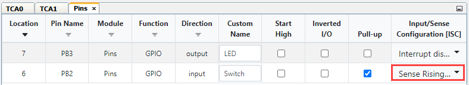
- Click `TCA0` under **Project Resources**, go to **Drivers**, then **Timer**
  - Turn on `Enable Compare Channel 0 interrupt`
  - Turn on `Enable Overflow interrupt`
  
  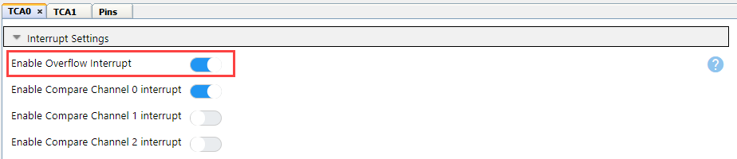
- Click `TCA1` under **Project Resources**, go to **Drivers**, then **Timer**
  - Turn on `Enable Overflow Interrupt`
  
  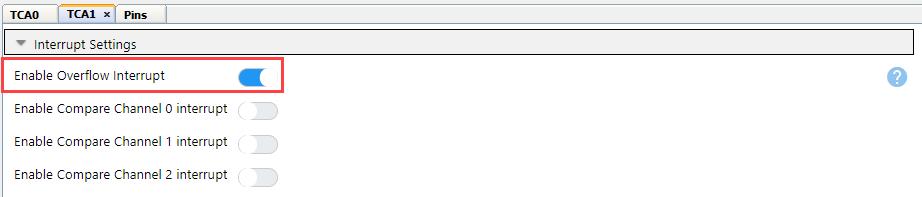

After the above interrupt settings, your `Interrupt Tables` in `Interrupt Manager` window would looks like this:

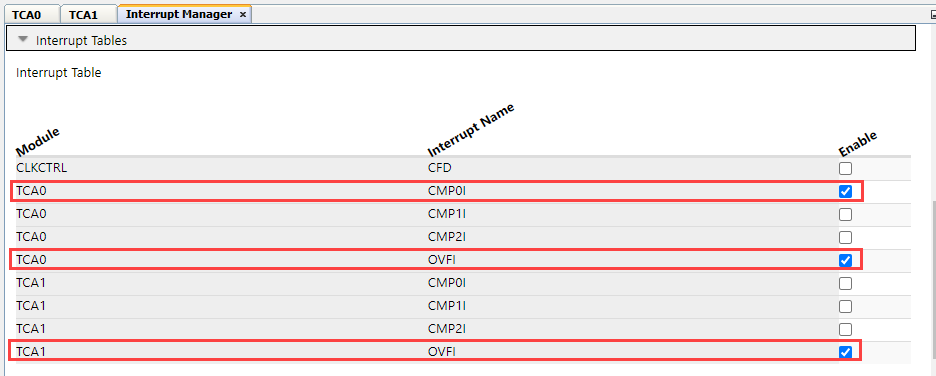

#### 4. Generate Code
- Click `Generate` next to the **Project Resources**
  
  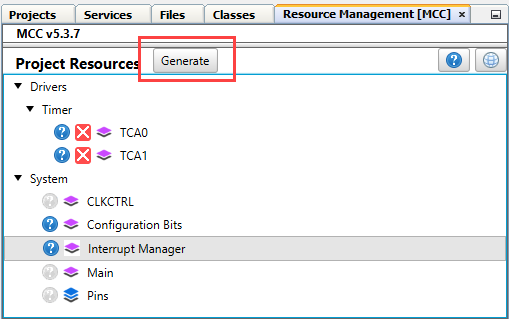


### Code Modifications

In this section, we are going to use the generated code and write our own interrupt handlers for the timers and the SW0 button in order to achieve the breathing LED affect.

#### 1. Toggle the LED

- Open **"main.c"** file

  - Turn the LED on when TCA0 overflow interrupt happens (every 500 us)
  - Turn the LED off when TCA0 Channel 0 interrupt happens (every 500 x DutyCycle% us)
  ```C
  void turn_led_on()
  {
      LED_SetLow();
  }

  void turn_led_off()
  {
      LED_SetHigh();
  }

  int main(void)
  {
      SYSTEM_Initialize();

      TCA0_OverflowCallbackRegister((TCA0_cb_t) turn_led_on);//
      TCA0_Compare0CallbackRegister((TCA0_cb_t) turn_led_off);//

      while (1)
      {
      }
  }
  ```

> &#128064;: If you click `Make and Program Device Main Project`  now, the LED on the Curiosity Nano board will appear dim.
> 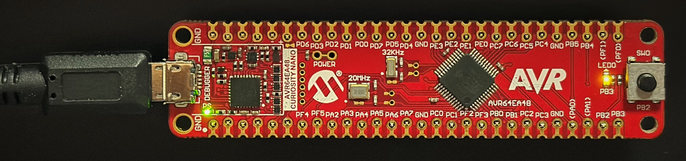


#### 2. Breathing the LED

- Open **"mcc_generated_files\timer\src\tca0.c"** file

  - Remember the hex values generated for `TCA0.SINGLE.CMP0` when you set `Duty Cycle 0 (%)` to `10` and `90` in MCC

- Open **"main.c"** file

  - Store the two hex values as `tca0Cmp0Start` and `tca0Cmp0End`
    ```C
    register16_t tca0Cmp0DutyCycle95 = 0x2EE;
    register16_t tca0Cmp0DutyCycle10 = 0x53;
    ```

  - Set a `difference` value that you want `TCA0.SINGLE.CMP0` to be changed each time 
    ```C
    register16_t difference5 = 0x2A;
    ```

  - Create a boolean `tca0Cmp0GoUp` to indicate now we should add or minus `difference` for `TCA0.SINGLE.CMP0`
    ```C
    bool tca0Cmp0GoUp = true;
    ```

  - Create a function that updating `tca0Cmp0GoUp` and `TCA0.SINGLE.CMP0`
    ```C
    void update_tca0_cmp0(void)
    {
        if (TCA0.SINGLE.CMP0 >= tca0Cmp0DutyCycle95)
        {
            tca0Cmp0GoUp = false;
        }
        if (TCA0.SINGLE.CMP0 <= tca0Cmp0DutyCycle10)
        {
            tca0Cmp0GoUp = true;
        }
        if (tca0Cmp0GoUp)
        {
            TCA0.SINGLE.CMP0 += difference5;
        }
        else
        {
            TCA0.SINGLE.CMP0 -= difference5;
        }
    }
    ```

  - Update `TCA0.SINGLE.CMP0` when TCA1 overflow interrupt happens (every 80ms)
    ```C
    int main(void)
    {
        SYSTEM_Initialize();

        TCA0_OverflowCallbackRegister((TCA0_cb_t) turn_led_on);
        TCA0_Compare0CallbackRegister((TCA0_cb_t) turn_led_off);
        TCA1_OverflowCallbackRegister((TCA1_cb_t) update_tca0_cmp0);//

        while (1)
        {
        }
    }
    ```

> &#128064;: If you click `Make and Program Device Main Project`  now, the LED on the Curiosity Nano board will show a breathing affect.
> 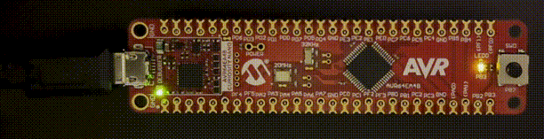


#### 3. Switch Breathing Speed

- Open **"mcc_generated_files\timer\src\tca1.c"** file
  - Remember the hex values generated for `TCA1.SINGLE.PER` when you set `Requested Timeout (s)` to `20` and `80` in MCC

- Open **"main.c"** file
  - Store the two hex values as `tca1Timeout80ms` and `tca1Timeout20ms`
    ```C
    register16_t tca1Timeout80ms = 0x8234;
    register16_t tca1Timeout20ms = 0x208C;
    ```

  - Create a function that switch `TCA1.SINGLE.PER` between 20ms and 80ms 
    ```C
    void switch_tca1_period(void)
    {
      TCA1.SINGLE.PER = TCA1.SINGLE.PER == tca1Timeout80ms ? tca1Timeout20ms : tca1Timeout80ms;
    }
    ```

  - Update `TCA1.SINGLE.PER` when the switch is released
    ```C
    int main(void)
    {
        SYSTEM_Initialize();

        TCA0_OverflowCallbackRegister((TCA0_cb_t) turn_led_on);
        TCA0_Compare0CallbackRegister((TCA0_cb_t) turn_led_off);
        TCA1_OverflowCallbackRegister((TCA1_cb_t) update_tca0_cmp0);
        Switch_SetInterruptHandler(switch_tca1_period);//
        
        while (1)
        {
        }
    }
    ```

> &#128064;: Click the `Make and Program Device Main Project`  to see a breathing LED! Press the button on the board to see a faster breathing LED!
> 


## Summary
The 'BreathingLED_AVR_Melody' code example uses the AVR64EA48 Curiosity Nano Development board to demonstrate how to: 
  - set up a PWM with timer using MCC Melody;
  - adjust brightness of a LED by setting PWM duty cycle;
  - create self-defined interrupt handler;
  - avoid using Configurable Logic Cell (CLC) or external wires to toggle the LED.
